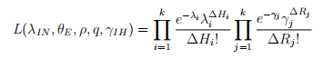
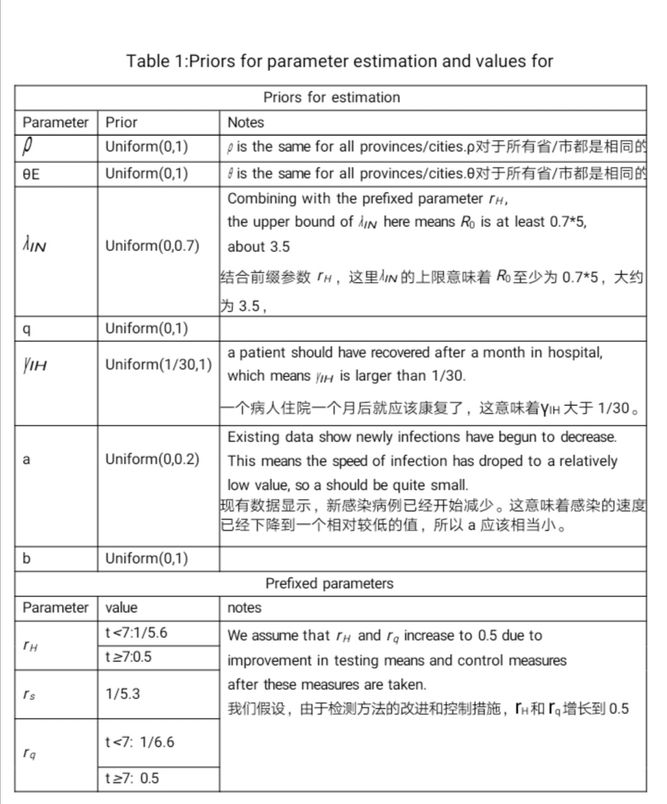
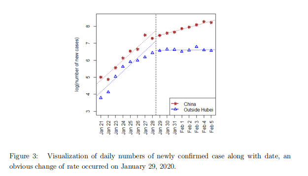
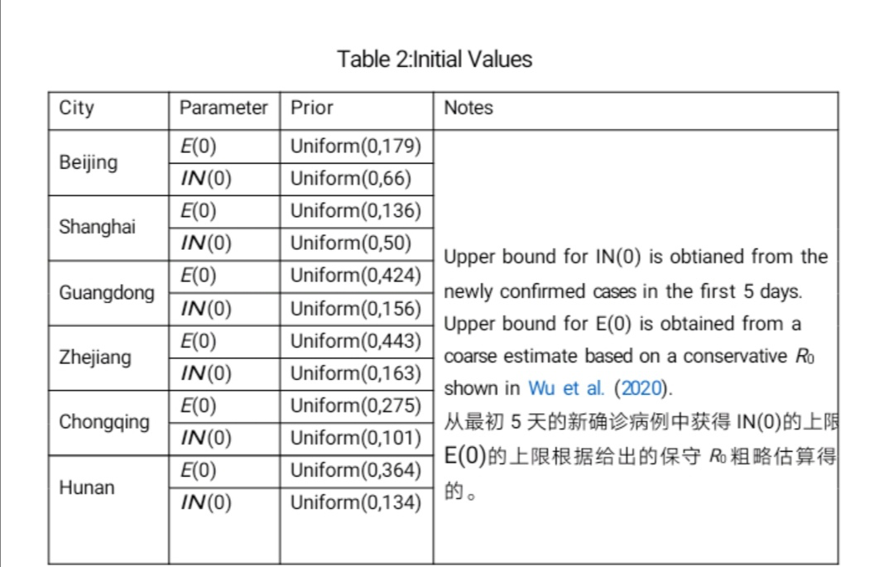
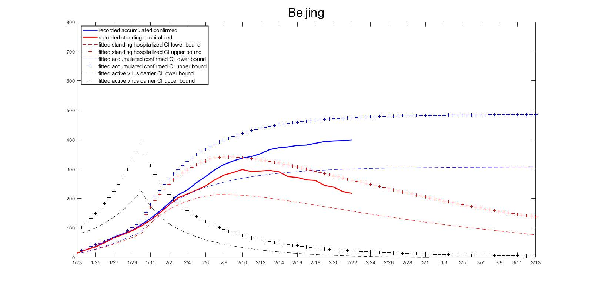
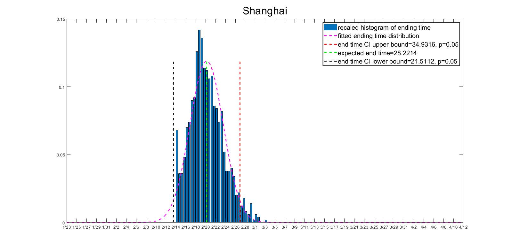
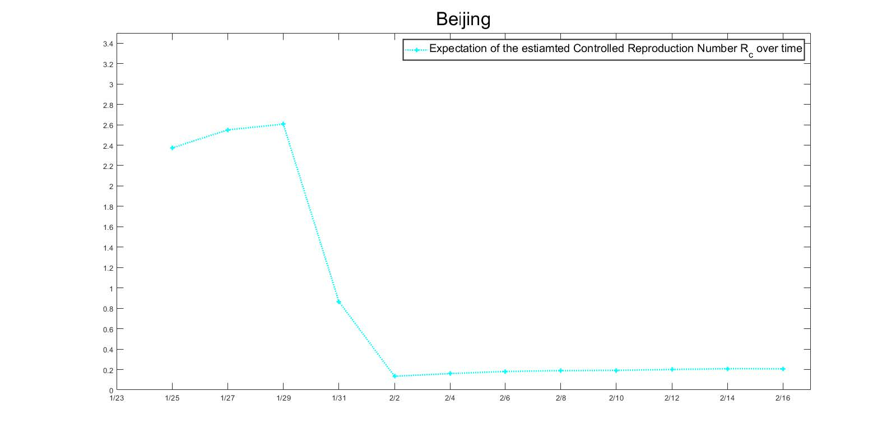
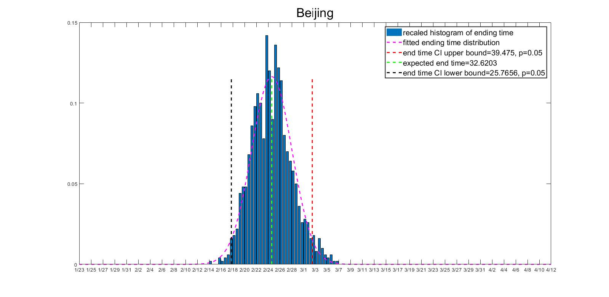
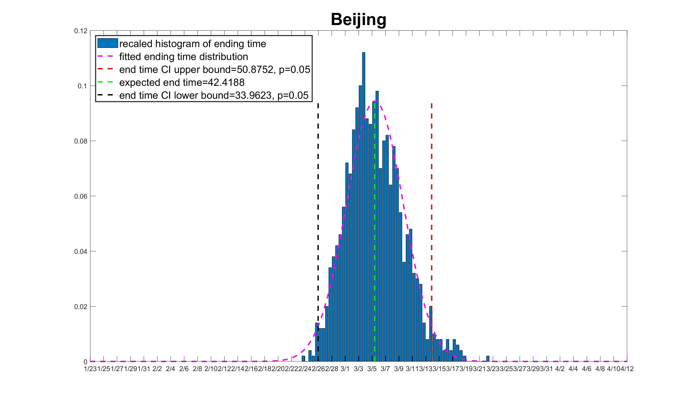

# 1.研究模型的选择

&emsp;&emsp;当前的2019年冠状病毒疾病爆发(COVID-19)现在已经成为一场全球性危机。为了对病毒的传播进行控制和预防，中国自2020年1月19日起实施了各种措施，包括交通限制、医疗追踪、出入境检查、隔离、检疫和宣传活动等。特别是2020年1月23日，湖北省出台了严格的限行令，湖北各城市从此被封锁。

&emsp;&emsp;为了对新型冠状病毒进行研究，动态模型可能是研究流行病发展规律最古老、最著名的数学工具之一。近一个世纪前由Kermack and McKendrick (1927)提出的SIR模型是第一个(也是最重要的一个)试图用确定性常微分方程系统来描述流行病的发展的。多年来，人们对原始的SIR模型进行了大量的修改和推广以适应不同的流行特征，其中，SIS模型和SEIR模型是被大家最广泛接受的模型。在COVID-19的爆发中，各种确定性的动力学模型也被重新设计和应用来研究问题。

----

&emsp;&emsp;例如，通过考虑临床进展、流行病学状况和干预措施，提出一个确定性模型，但它假设暴露的人群没有传染性，这不符合COVID-19的特征，另外这一模型假设一旦感染就实施隔离，这不能反映医疗追踪带来的不可避免的延迟。还有研究提出了一个考虑城市间传输的扩展SEIR模型，但这一模型没有考虑到隔离和医疗追踪等控制措施，并假设接触人群没有传染性，这也与现实情况不完全相符。

&emsp;&emsp;除了ODE模型之外，另一种方法是考虑DE模型预测COVID-19的趋势，这一模型正确地考虑了传染潜伏期，却没有考虑症状出现与诊断或医学追踪之间的时间差。此外，假设有症状和无症状患者之间的传播概率相等也存在疑问。

&emsp;&emsp;因此与确定性模型不同，疾病的传播是随机的。因此，与确定性模型相比，随机模型可以更好地解释COVID-19爆发的不可忽略的随机性。并且在此次研究中，加入了传染性潜伏期和无症状携带者，以及医学追踪等控制措施这些之前未被考虑在内的问题。
    
  

  
----

&emsp;&emsp;为了弥补现有研究中存在的上述问题，并描述一种更为现实的传播机制，这里提出了一种新的随机模型，考虑了COVID-19独特的传播动力学和干预措施的效果。我们提出的随机模型旨在从以下几个方面研究COVID-19爆发：

&emsp;&emsp;-关键流行病学参数的估计：

&emsp;&emsp;模型中的参数具有特定的流行病学意义：
 
&emsp;&emsp;ρ：有症状病毒携带者的比例
  
&emsp;&emsp;$θ_E$：代表无症状病毒携带者和有症状病毒携带者的感染性比例
  
&emsp;&emsp;q：各地区的隔离强度

&emsp;&emsp;-流行病发展预测:

&emsp;&emsp;通过一组估计参数和初始值，我们能够模拟流行病随时间t的发展情况，由此可以得到流行病的传播趋势。

----

&emsp;&emsp;-估计不可观察的携带者和流行病的控制日期：

&emsp;&emsp;人群中无法观察的病毒携带者对于流行病的传播情况是不可忽略的，选择随机模型以考虑不可观察携带者的趋势，而不是仅仅通过现有的感染进行流行病控制评估，根据不可观测携带者的模拟，也可以求得疫情得到控制的时间。

&emsp;&emsp;-控制措施评估：

&emsp;&emsp;控制后的病毒感染数$R_c$反映了流行病的传播能力，对于评估控制措施和疾病传播速度至关重要，可以根据在给定时间段内活跃病毒携带者的进出流量之比来估计。

----

# 2.方法应用

## 2.1 数据来源

&emsp;&emsp;本研究所使用的数据包括中国以下省市的确诊、恢复和死亡人数：北京、上海、重庆、广东、浙江和湖南。这些公开数据来自北京市卫生委员会（2020年）、上海市卫生委员会（2020年）、重庆市卫生委员会（2020年）、广东省卫生委员会（2020年）、浙江省卫生委员会（2020年）和湖南省卫生委员会（2020年）。各地区居民相应人口来源于中国国家统计局（2018年）。

&emsp;&emsp;需要注意的是，本研究没有使用湖北省的数据，原因如下：

&emsp;&emsp;（1）湖北省的医疗资源在疫情开始时就负担过重，并非所有确诊的个人都能立即住院治疗。

&emsp;&emsp;（2）湖北省的诊断标准随着时间的推移而改变，导致2月中旬确诊病例激增。

&emsp;&emsp;（3）湖北省的病死率远高于全国其他地区。

&emsp;&emsp;这些特征使湖北省的动力模型与中国其他地区的模型不同，所以此次研究时使用的数据均是来自湖北省以外的。

----  

## 2.2模型构建

&emsp;&emsp;流行病的演变通常由确定性动态模型或随机模型构建。其中，随机模型通常被认为比确定性模型更现实。随机模型通常使用连续时间、区间马尔可夫过程来描述流行病的演变。特别是，当疫情规模与总人口规模不可比时，随机性更为显著，因此需要一个随机模型来量化这种情况下估计和预测的不确定性。在我们的研究中，没有一个省市的累计确诊病例超过2000例。这些数字虽然令人警觉，但无法与各省市的总人口相提并论。

&emsp;&emsp;COVID-19爆发的独特特征：

&emsp;&emsp;（1）传染性潜伏期:根据中华人民共和国国务院新闻办公室(2020年)的官方新闻简报，与以往疫情相比，此次新冠肺炎在潜伏期也具有传染性。

&emsp;&emsp;（2）大部分无症状病毒携带者。

&emsp;&emsp;（3）前所未有的接触控制和医疗跟踪措施

&emsp;&emsp; 现有的流行病随机动态模型尚未完全捕捉到这些特征。

&emsp;&emsp; 在温和的假设下

&emsp;&emsp; （1）系统中所有个体的运动都是独立的

&emsp;&emsp; （2）系统中的总人口是一个固定数目的$N$

---

&emsp;&emsp;基于如上假设，我们设计了随机模型

&emsp;&emsp; $S$ :易感人群

&emsp;&emsp; $E$ :接触人群，它分为以下四个子状态

&emsp;&emsp;&emsp;    -$E_{1}$\qquad :将来会变得有症状，并且在医学上不可追溯

&emsp;&emsp;&emsp;    -$E_{2}$\qquad :将来会出现症状，并可在医疗追踪中追踪
 
&emsp;&emsp;&emsp;    -$A_{1}$\qquad :将来不会出现症状，并且在医学上不可追溯

&emsp;&emsp;&emsp;    -$A_{2}$\qquad :将来不会出现症状，并且可以在医学上追溯

&emsp;&emsp; $Q$ :隔离态。它分为两个子状态:

&emsp;&emsp;&emsp;    -$E_{q}$\qquad：将来会有症状

&emsp;&emsp;&emsp;    -$A_{q}$\qquad：将来不会成为症状

&emsp;&emsp; $IN$ ：感染态，有症状，但尚未住院。它们分为两个子状态:

&emsp;&emsp;&emsp;    -$IN_{1}$\qquad:在医学追踪中不可追踪。

&emsp;&emsp;&emsp;    -$IN_{2}$\qquad:医学追踪中的可追溯性。

---

&emsp;&emsp; $IH$ :感染态，有症状，目前正在住院治疗。它们分为两个子状态:

&emsp;&emsp;&emsp;   -$IH_{l}$\qquad:症状轻微

&emsp;&emsp;&emsp;   -$IH_{S}$\qquad:症状严重

&emsp;&emsp; $R$ :恢复态。它们分为三个子状态:
     
&emsp;&emsp;&emsp;   -$R_{A}$\qquad:从状态$A_{1}$\qquad和$A_{2}$\qquad 恢复。

&emsp;&emsp;&emsp;   -$R_{N}$\qquad:从状态$IN_{1}$\qquad和$IN_{2}$\qquad 恢复。
  
&emsp;&emsp;&emsp;   -$R_{H}$\qquad:从$IH_{l}$\qquad 恢复过来。

&emsp;&emsp; $D$：死亡态

---

&emsp;&emsp;注：在特定时间，每个人都可以被划分为上述状态之一。为了简明起见，我们将$S(t)$、 $E_{1}(t)$\qquad、$E_{2}(t)$\qquad 等表示为在时间t的相应状态中的群体大小。 $\xi(t)=｛S(t),E_{1}(t),E_{2}(t),E_{q}(t),A_{1}(t),A_{2}(t),A_{q}(t),IN_{1}(t),IN_{2}(t),IH_{l}(t),IH_{s}(t),R_{A}(t),R_{N}(t),R_{H}(t)｝$ 是随时间t的演化形成具有状态空间的连续时间马尔可夫过程{0, 1, 2, ..., N}

&emsp;&emsp;描述如下:

&ensp; &ensp;感染:每一个原发病例(包括$E_{1}(t)$\qquad、$E_{2}(t)$\qquad、$A_{1}$\qquad 、$A_{2}$\qquad 、 $IN_{1}$\qquad 和 $IN_{2}$\qquad 等状态的病例)将病原体分别以泊松比 $\lambda_{E}=\lambda_{IN}\theta_{E}$、$\lambda_{A}=\lambda_{IN}\theta_{A}$  和 $\lambda_{E}=\lambda_{IN}$ 传给其继发病例。具体来说，主要病例从总人群中随机选择一个个体，如果该个体处于状态 $S$，则该个体被感染。在每个传播事件中，在概率 $\rho$ 下，第二种情况变成 $E_{1}(t)$\qquad 或 $E_{2}(t)$\qquad，同时，这种接触可以用概率 $q$ 来追踪；概率为 $1-ρ$ 时，第二种情况变为 $A_{1}$\qquad 或 $A_{2}$\qquad ，同时接触可追溯到概率 $q$。

&ensp; &ensp;隔离:状态 $E_{2}(t)$\qquad、$A_{2}$\qquad 和 $IN_{2}$\qquad 的每个个体都将被隔离，然后分别以泊松速率 $r_{q}$\qquad 转移到状态 $E_{q}(t)$\qquad,$A_{q}(t)$\qquad 和 $IN$。注意:我们假设这些人将被隔离或住院直到康复或者死亡。
  

&ensp; &ensp;住院治疗:$IN$状态的每个人都将按照参数为$r_{H}$\qquad 泊松比住院治疗。概率为 $p_{1}$\qquad 时，它将转移到 $IH_{l}$\qquad，概率为 $1-p_{1}$\qquad 时，它将转移到 $IH_{s}$\qquad。

&ensp; &ensp;症状缓解:$IH_{s}$\qquad 状态的每一个人都将按 $r_{b}$\qquad 的泊松比转移到 $IH_{l}$\qquad。

&ensp; &ensp;恢复：$A_{1}$\qquad、$A_{2}$\qquad、$IN$  和 $IH_{l}$\qquad 状态的每个人都会以泊松比 $r_{\alpha}$\qquad，$r_{IN}$\qquad 和 $r_{IH}$\qquad 的速度恢复

&ensp; &ensp;死亡：状态为 $IN$ 和 $IH_{s}$\qquad 的每个个体将以 $\delta_{IN}$\qquad 和 $\delta_{IH}$\qquad 的泊松比死亡

---

&ensp; &ensp;  整个过程由下图表示：
&ensp; &ensp;

---

&ensp; &ensp;我们用如下的平均场微分方程系统具体描述各个状态之间的转移：
           

----

## 2.3初始值的选择和模型参数估计

    

 

&emsp;&emsp;可以基于图二的简化模型估计这个随机模型的参数和初始值。因为所有选中地区的死亡率都非常低，所以删除Dead这个阶段。在时间t的现有确诊病例数和已报告痊愈人数是可以直接观察到的，但其他潜在状态是观察不到的。在潜在状态中，初始值S（0）近似于城市或省的常住人口数；由于1月23号之前还没有实施封城隔离，所以Eq（0）设置为0；RN（0）可以设置成任意值，因为它不会影响模型的估计和预测结果。在本研究中，IN(0)和E(0)被视为未知参数，并与其他模型参数一起进行估计。

&emsp;&emsp;模型中一共有9个参数，他们是λIN ,θE ,,ρ,q,γIH ,γA,rs,rq和rH。
其中，rs,rq和rH与临床特征有关，可通过现有研究确定。更具体得说，rH是从出现症状到诊断的平均时间的倒数；rs是平均潜伏期的倒数；rq是infectious period和serial interval平均差的倒数。在初步试验的基础上，我们发现从数据中获得的γA的信息非常有限，而且估计值受前期选择的影响很大。一种可能的解释是，γA与观测值的关系不大。因此，我们把 γA = 1/10作为前缀，并且对γA的不同取值进行了敏感性分析。

----

&emsp;&emsp;其余的参数将从模型中估算出来。其中，参数ρ和θE与疾病的性质直接相关，因此在中国被认为是常数。但是，λIN、q和γIH在不同地区可能有所不同，这取决于当地的医疗资源、人口密度和控制措施。此外，将λIN和γIH作为时变参数来反映干预政策的效果和医疗水平的提高更为现实。此次研究中，使用了一个简单的时变函数设置，即

&emsp;

$$λIN(t)= 1 { t < T1 }λIN0+1 { t > T1 }aλIN0\tag{1}$$
&emsp;
$$γIH(t)= 1 { t < T2 }bγIH0+1 { t > T2 }γIH0\tag{2}$$

&emsp;时间T1设置为1月29日，因为从图3可以看出1月29日新增确诊病例速率发生显著变化。我们用观测到的{RH(t+1)-RH(t)}/IH(t)来估计t时的γIH。时间T2设置为各省/市γIH发生显著变化的时间。假设每日确诊病例和治愈人数是独立的泊松随机变量(吴等，2020)，得到下面的似然函数

其中，ΔHt和ΔRt是第t天新增确诊病例和新增治愈人数，λt和γt是参数E(0)、IN(0)、λIN、θE、ρ、q和γIH的函数，参数基于平均场微分方程。通过先验均值估计参数，其中无信息均值分布被选为先验分布，更多详情见表1和表2。

----

----

----

# 3.结果
    
&ensp; &ensp;主要分为以下三个部分

&emsp;&emsp;1、参数解释

&emsp;&emsp;2、流行病趋势预测

&emsp;&emsp;3、研究结果

----

## 3.1参数解释

&ensp;&ensp;1.$γ_A$分别取值为1/7,1/10,1/14，从参数的估计汇总中我们可以发现以下三点：

&emsp;&emsp;(1)ρ的估计值对$γ_A$的选择不敏感，大约30%的感染者无症状；

&emsp;&emsp;(2)对于不同的$γ_A$选择，$θ_E$的估计值相当接近。有症状的患者将病原体传染给他人的可能性是无症状患者的两倍；

&emsp;&emsp;(3)除上海外，q的估计值对$γ_A$的选择不敏感。在我们所研究的省市中浙江的q值最高，这也与浙江省人民政府所做的努力相一致，截至2020年3月2日，该政府已成功追踪了4万多个密切接触者。

&emsp;

&ensp; &ensp;2.对$γ_A$的敏感性分析表明:

&emsp;&emsp;(1)对于$γ_A$的不同值，γIH和b的估计是一致的，因为RH和IH状态都是可观测的；

&emsp;&emsp;(2)对于$γ_A$的不同值，所研究省市中的状态E和IN估计的初始人数有所不同，但仍处于同一数量级；

&emsp;&emsp;(3)在广东、浙江和上海，λIN和a的估计值随$γ_A$的不同而变化。

----

## 3.2流行病趋势预测

&ensp; &ensp;&ensp;&ensp;基于所估计出的参数，对流行病的未来发展趋势进行模拟。趋势预测分为以下四部分：

&emsp;&emsp;1、关键人群流行病趋势的预测

&emsp;&emsp;2、流行病的控制时间预测

&emsp;&emsp;3、预测的时变$R_c$曲线

&emsp;&emsp;4、医疗追踪政策有效性评价

----

### 3.2.1 关键人群的预测置信区间

&ensp;&ensp;对于每个省市，进行1000次模拟，生成关键人群流行病发展趋势95%的置信区间。

    

 

&ensp;&ensp;其中蓝色的线代表的是累计确诊病例数即IH、RH和D的总和，红色的线表示的是IH，这两个部分都是可以直接观测到的，从图中可以看出，实际数据很好的处在预测区间内，说明预测结果较好。模型中使用的数据是到2月21日，但是我们能够预测一下它们未来的趋势，比如红色的线有向下趋势的时间。黑色的线代表的是活跃病毒的携带者数，即E和IN的总和，这部分是观测不到的。$γ_A$的敏感性分析表明，预测的置信区间对于不同的$γ_A$是稳定的，这也有理由更加相信所提出的模型是能够捕捉到流行病的发展趋势。

----

### 3.2.2流行病的控制时间预测

&ensp; &ensp;流行病传播是由于存在活跃的病毒携带者，因此当活跃的病毒携带者的数量减少到一定水平时新的感染是有限的，这也意味着流行病得到了控制。所这里定义流行病得到控制的时间为活跃病毒携带者数量首先小于阈值$T_c$。

    

 

&ensp; &ensp;当$T_c=10$时，本研究的六个省市中，上海的控制时间预计为2月21日，而广东的控制时间预计为3月7日左右。根据《中国NHC》报道，2月17日至2月21日上海市新发感染分别为0、0、0、1、0；同期广东新感染人数为6，3，1，1，6，这也可能支持了我们的预测。在对$γ_A$的敏感性分析中，我们发现当无症状患者$γ_A$的恢复率变小时，预期的流行病控制时间变长，因为较小的$γ_A$意味着无症状患者需要的恢复时间更长，活跃病毒的携带时间就更长。

----

### 3.2.3预测的时变$R_c$曲线

&emsp;&emsp;在本研究中，控制再生数$R_c$的变化通过给定时间段内活跃病毒携带者的流入和流出之间的比率来近似。也就是说，对于为∆t时间间隔，例如[t，t+∆t]，我们保持跟踪活跃病毒携带者群体E和IN的变化，并记录它们的累积数量。我们通过它的平均值来估计[t，t+∆t]的$R_c$。准确地说，我们定义如下公式，其中两个变量都是非负有限整数。
&emsp;

$$\bar{R_c}([t, t + ∆t]) = R_cIN([t, t + ∆t])/ R_cOUT ([t, t + ∆t])\tag{1}$$
&emsp;
$$R_cIN([t, t + ∆t]) = card ({t∈ [t, t + ∆t], E(t) + IN(t) = E(t−) + IN(t−) + 1})\tag{2}$$ 

&emsp;
$$R_cOUT ([t, t + ∆t]) = card ({t∈ [t, t + ∆t], E(t) + IN(t) = E(t−) + IN(t−) − 1})\tag{3}$$

    

 

&emsp;&emsp;我们发现大多省市的$R_c$在控制措施实施之前是位于2到3之间，但在1月29日和2月1日期间，迅速下降到0.2左右的位置。

----

### 3.2.4 医疗追踪政策有效性评价

&ensp; &ensp;在保持估计的其他参数不变，设置可追踪比率q =0来表示没有实施医疗追踪政策。

    

 

    

 

&ensp; &ensp;对于本研究中选定的省市，当q=0时，流行病也将会被控制，是由于接触控制措施，减少了λ值以及诊断等待时间。但是流行病控制日期有显著的延迟，这表明当前的医疗追踪政策在控制流行病方面有显著贡献。 

----

## 3.3 研究结果

&ensp; &ensp;&ensp;&ensp;研究的主要发现有以下几点:

&emsp;&emsp;1、无症状病毒携带者是不可忽视的一部分，大概有30%的患者是无症状感染者。

&emsp;&emsp;2、与无症状病毒携带者相比，有症状的患者传播能力大约是其两倍。

&emsp;&emsp;3、选定省市的流行病控制时间估计在2月下旬至3月上旬左右。

&emsp;&emsp;4、在选定的省份中，控制再生数$R_c$在2到3之间，并且自控制措施实施以来显著减少。

&emsp;&emsp;5、在选定的省市，发现除了减少人与人接触的控制措施之外，医疗追踪工作对控制该流行病也作出了重大贡献。

----

# 4.讨论

&ensp; &ensp;1.模型局限性：

&emsp;&emsp;(1)鉴于现有数据有限，确切地说是参数，特别是现有模型中观测不到的参数，可能存在识别问题的风险；

&emsp;&emsp;(2)当前的估计方法收敛缓慢；

&emsp;&emsp;(3)如果将来对当前的计划免疫控制或治疗措施进行重大改变，则现有的模型不适用；

&emsp;&emsp;(4)隔离结束后,如果无症状患者中一部分仍具有传染性,那么现有的模型需要进一步修改；

&emsp;&emsp;(5)如果随机模型过分偏离简单化模型，参数估计可能会失去精度。

&emsp;

&ensp; &ensp;2.模型改进：

&emsp;&emsp;(1)改进医疗跟踪动态；

&emsp;&emsp;(2)引进医疗服务能力；

&emsp;&emsp;(3)模拟人口流动。

----
&emsp;
&emsp;
&emsp;

感谢大家的聆听！

    

 

