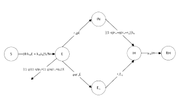
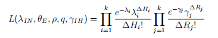
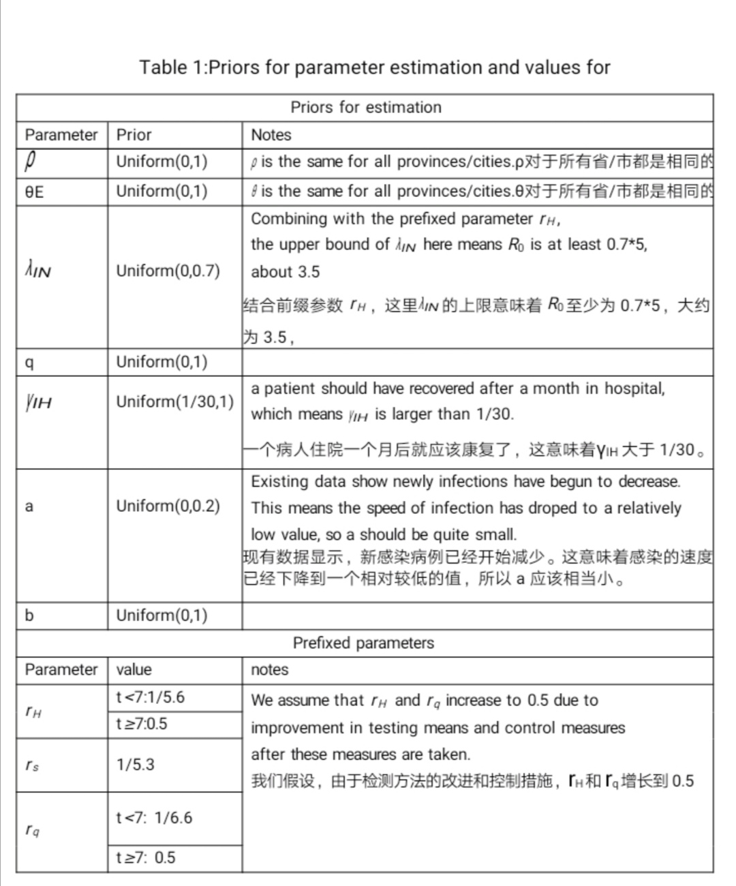
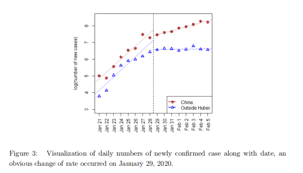
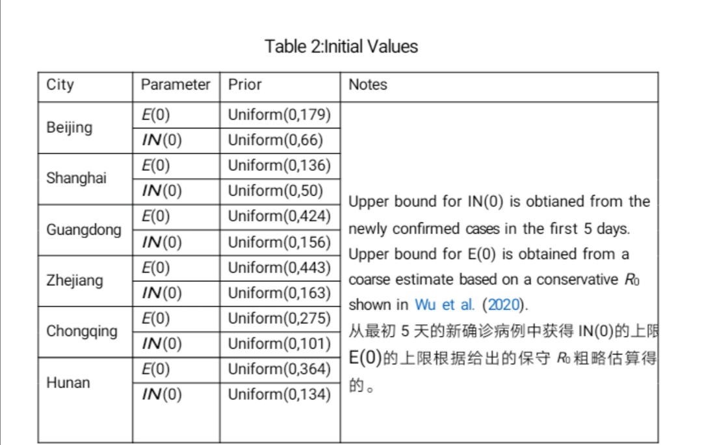

----

## 2.3初始值的选择和模型参数估计

&emsp;&emsp;可以基于图二的简化模型估计这个随机模型的参数和初始值。因为所有选中地区的死亡率都非常低，所以删除Dead这个阶段。在时间t的现有确诊病例数和已报告痊愈人数是可以直接观察到的，但其他潜在状态是观察不到的。在潜在状态中，初始值S（0）近似于城市或省的常住人口数；由于1月23号之前还没有实施封城隔离，所以Eq（0）设置为0；RN（0）可以设置成任意值，因为它不会影响模型的估计和预测结果。在本研究中，IN(0)和E(0)被视为未知参数，并与其他模型参数一起进行估计。

&emsp;&emsp;模型中一共有9个参数，他们是λIN ,θE ,,ρ,q,γIH ,γA,rs,rq和rH。
其中，rs,rq和rH与临床特征有关，可通过现有研究确定。更具体得说，rH是从出现症状到诊断的平均时间的倒数；rs是平均潜伏期的倒数；rq是infectious period和serial interval平均差的倒数。在初步试验的基础上，我们发现从数据中获得的γA的信息非常有限，而且估计值受前期选择的影响很大。一种可能的解释是，γA与观测值的关系不大。因此，我们把 γA = 1/10作为前缀，并且对γA的不同取值进行了敏感性分析。

----

&emsp;&emsp;其余的参数将从模型中估算出来。其中，参数ρ和θE与疾病的性质直接相关，因此在中国被认为是常数。但是，λIN、q和γIH在不同地区可能有所不同，这取决于当地的医疗资源、人口密度和控制措施。此外，将λIN和γIH作为时变参数来反映干预政策的效果和医疗水平的提高更为现实。此次研究中，使用了一个简单的时变函数设置，即λIN(t)= 1 { t < T1 }λIN0+1 { t > T1 }aλIN0和γIH(t)= 1 { t < T2 }bγIH0+1 { t > T2 }γIH0。
时间T1设置为1月29日，因为从图3可以看出1月29日新增确诊病例速率发生显著变化。我们用观测到的{RH(t+1)-RH(t)}/IH(t)来估计t时的γIH。时间T2设置为各省/市γIH发生显著变化的时间。假设每日确诊病例和治愈人数是独立的泊松随机变量(吴等，2020)，得到下面的似然函数

其中，ΔHt和ΔRt是第t天新增确诊病例和新增治愈人数，λt和γt是参数E(0)、IN(0)、λIN、θE、ρ、q和γIH的函数，参数基于平均场微分方程。通过先验均值估计参数，其中无信息均值分布被选为先验分布，更多详情见表1和表2。

----

----

----

