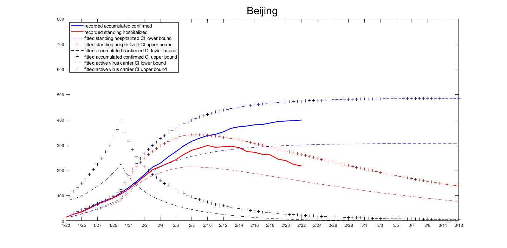
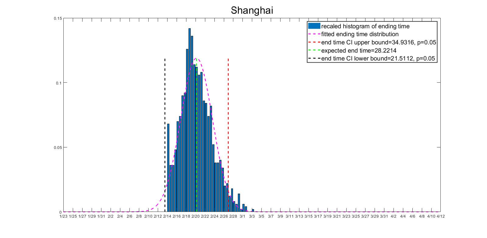
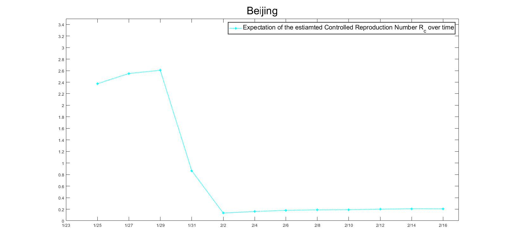
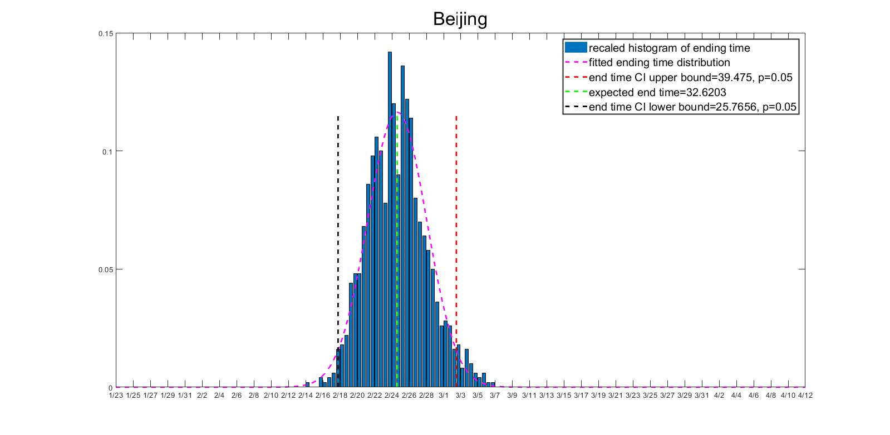
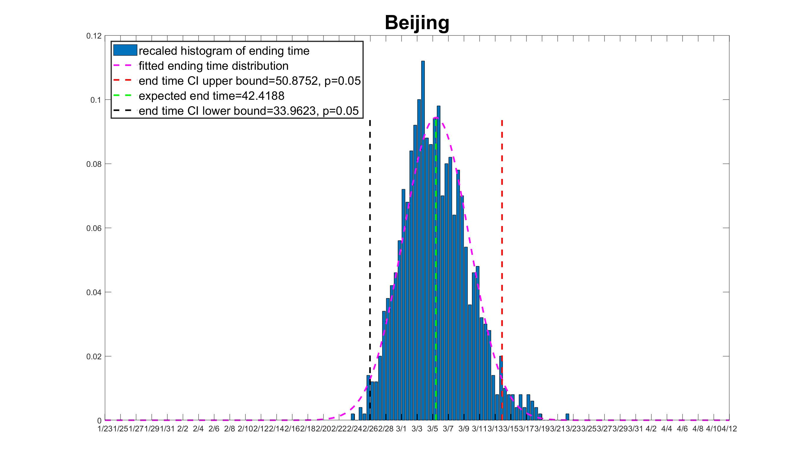

# 3.结果及讨论

    
&ensp; &ensp;主要分为以下三个部分

&emsp;&emsp;1、参数解释

&emsp;&emsp;2、流行病趋势预测

&emsp;&emsp;3、现有模型的局限性

    

----

## 3.1参数解释

&ensp; &ensp;&ensp;&ensp;根据对模型参数的估计汇总，我们可以发现以下三点：

&emsp;&emsp;1、ρ的估计值对$γ_A$的选择不敏感，大约30%的感染者无症状。

&emsp;&emsp;2、对于不同的$γ_A$选择，$θ_E$的估计值相当接近。有症状的患者将病原体传染给他人的可能性是无症状患者的两倍。

&emsp;&emsp;3、除上海外，q的估计值对$γ_A$的选择不敏感。在我们所研究的城市中浙江的q值最高，这也与浙江省人民政府所做的显著努力相一致，截至2020年3月2日，该政府已成功追踪了4万多个密切联系者。

----

## 3.2流行病趋势预测

&ensp; &ensp;&ensp;&ensp;基于所估计出的参数，对流行病的未来轨迹进行模拟。趋势预测分为以下四部分：

&emsp;&emsp;1、关键人群流行病趋势的预测

&emsp;&emsp;2、流行病的控制时间预测

&emsp;&emsp;3、预测的时变$R_c$曲线

&emsp;&emsp;4、医疗追踪政策有效性评价

----

### 3.2.1 关键人群的预测置信区间

&ensp; &ensp;&ensp;&ensp;对于每个城市，进行1000次模拟，生成关键人群流行病发展趋势的95%置信区间，其中累计确诊病例数是IH、RH和D的总和。

    

 

----

### 3.2.2流行病的控制时间预测

&ensp; &ensp;&ensp;&ensp;流行病的传播由于存在活跃的病毒携带者，因此当活跃的病毒携带者的数量减少到一定水平时，新的感染是有限的，这也意味着流行病得到了控制。所这里定义流行病得到控制的时间为活跃病毒携带者数量首先小于阈值$T_c$。

    

 

&ensp; &ensp;&ensp;&ensp;本研究的六个省市中，上海的最早控制时间预计为2月21日，而广东的最晚控制时间预计为3月7日左右。根据《中国NHC日报》报道，2月17日至2月21日上海市新发感染分别为0、0、0、1、0；同期广东新感染人数为6，3，1，1，6，这可能支持我们的预测。
注意，在对γA的敏感性分析中，我们发现当无症状患者γA的恢复率变小时，预期的流行病控制时间变长。

----

### 3.2.3预测的时变$R_c$曲线

&emsp;&emsp;控制再生数$R_c$反映了流行病的传播能力，这是流行病学中最重要的变量之一。

&emsp;&emsp;在本研究中，$R_c$的变化通过给定时间段内活跃病毒携带者的流入和流出之间的比率来近似，也就是说，对于为∆t时间间隔，例如[t，t+∆t]，我们保持跟踪导致活跃病毒携带者群体E和IN的增加/减少的变化	，并记录它们的累积数量。准确地说，我们定义如下公式。

&emsp;
$$R_cIN([t, t + ∆t]) = card ({t∈ [t, t + ∆t], E(t) + IN(t) = E(t−) + IN(t−) + 1})\tag{1}$$ 

&emsp;
$$R_cOUT ([t, t + ∆t]) = card ({t∈ [t, t + ∆t], E(t) + IN(t) = E(t−) + IN(t−) − 1})\tag{2}$$

&emsp;

$$\bar{R_c}([t, t + ∆t]) = R_cIN([t, t + ∆t])/ R_cOUT ([t, t + ∆t])\tag{3}$$

    

 

&emsp;&emsp;我们发现大多省市的$R_c$在控制措施实施之前是位于2到3之间，但在1月29日和2月1日期间，迅速下降到0.2左右的位置。

----

### 3.2.4 医疗追踪政策有效性评价

&ensp; &ensp;&ensp;&ensp; 在保持估计的其他参数不变，设置可追踪比率q =0来表示没有实施医疗追踪政策。

    

 

    

 
&ensp; &ensp;&ensp;&ensp;对于本研究中选定的省市，当q = 0时，流行病控制日期有显著的延迟，这表明当前的医疗追踪政策在控制流行病方面有显著贡献。

----

## 3.3 研究结果

&ensp; &ensp;&ensp;&ensp;研究的主要发现有以下几点:

&emsp;&emsp;1、无症状病毒携带者是不可忽视的一部分，大概有30%的患者是无症状感染者。

&emsp;&emsp;2、与无症状携带者相比，有症状的患者传播能力大约是其两倍。

&emsp;&emsp;3、选定省市的流行病控制时间估计在2月下旬至3月上旬左右。

&emsp;&emsp;4、在选定的省份和城市中，在得到控制的情况下传播情况$R_c$在2到3之间，并且自控制措施实施以来显著减少。

&emsp;&emsp;5、在选定的省市，发现除了减少人与人接触的控制措施之外，医疗追踪工作对控制该流行病也作出了重大贡献。

----

## 3.4 模型的局限性

&ensp; &ensp;&ensp;&ensp;模型的局限性：

&emsp;&emsp;1、当前的估计方法收敛缓慢；

&emsp;&emsp;2、如果将来对当前的计划免疫控制或治疗措施进行重大改变，则现有的模型不适用；

&emsp;&emsp;3、如果隔离结束后，无症状患者中一部分仍具有传染性,那么现有的模型需要进一步修改，。

----

