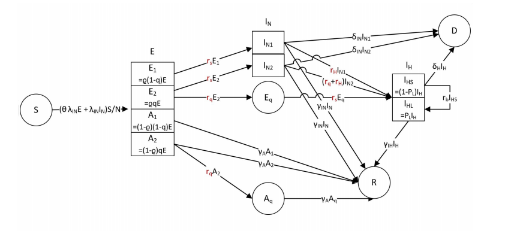
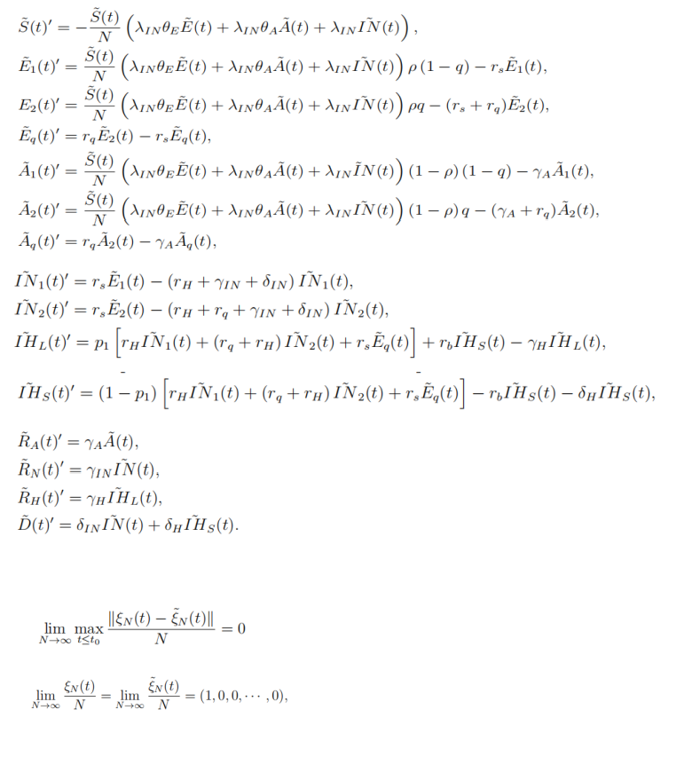

----

## 2.2模型构建

&emsp;&emsp;流行病的演变通常由确定性动态模型或随机模型构建。其中，随机模型通常被认为比确定性模型更现实。随机模型通常使用连续时间、区间马尔可夫过程来描述流行病的演变。特别是，当疫情规模与总人口规模不可比时，随机性更为显著，因此需要一个随机模型来量化这种情况下估计和预测的不确定性。在我们的研究中，没有一个省市的累计确诊病例超过2000例。这些数字虽然令人警觉，但无法与各省市的总人口相提并论。

&emsp;&emsp;COVID-19爆发的独特特征：

&emsp;&emsp;（1）传染性潜伏期:根据中华人民共和国国务院新闻办公室(2020年)的官方新闻简报，与以往疫情相比，此次新冠肺炎在潜伏期也具有传染性。

&emsp;&emsp;（2）大部分无症状病毒携带者。

&emsp;&emsp;（3）前所未有的接触控制和医疗跟踪措施

&emsp;&emsp; 现有的流行病随机动态模型尚未完全捕捉到这些特征。

&emsp;&emsp; 在温和的假设下

&emsp;&emsp; （1）系统中所有个体的运动都是独立的

&emsp;&emsp; （2）系统中的总人口是一个固定数目的$N$

---

&emsp;&emsp;基于如上假设，我们设计了随机模型

&emsp;&emsp; $S$ :易感人群

&emsp;&emsp; $E$ :接触人群，它分为以下四个子状态

&emsp;&emsp;&emsp;    -$E_{1}$\qquad :将来会变得有症状，并且在医学上不可追溯

&emsp;&emsp;&emsp;    -$E_{2}$\qquad :将来会出现症状，并可在医疗追踪中追踪
 
&emsp;&emsp;&emsp;    -$A_{1}$\qquad :将来不会出现症状，并且在医学上不可追溯

&emsp;&emsp;&emsp;    -$A_{2}$\qquad :将来不会出现症状，并且可以在医学上追溯

&emsp;&emsp; $Q$ :隔离态。它分为两个子状态:

&emsp;&emsp;&emsp;    -$E_{q}$\qquad：将来会有症状

&emsp;&emsp;&emsp;    -$A_{q}$\qquad：将来不会成为症状

&emsp;&emsp; $IN$ ：感染态，有症状，但尚未住院。它们分为两个子状态:

&emsp;&emsp;&emsp;    -$IN_{1}$\qquad:在医学追踪中不可追踪。

&emsp;&emsp;&emsp;    -$IN_{2}$\qquad:医学追踪中的可追溯性。

---

&emsp;&emsp; $IH$ :感染态，有症状，目前正在住院治疗。它们分为两个子状态:

&emsp;&emsp;&emsp;   -$IH_{l}$\qquad:症状轻微

&emsp;&emsp;&emsp;   -$IH_{S}$\qquad:症状严重

&emsp;&emsp; $R$ :恢复态。它们分为三个子状态:
     
&emsp;&emsp;&emsp;   -$R_{A}$\qquad:从状态$A_{1}$\qquad和$A_{2}$\qquad 恢复。

&emsp;&emsp;&emsp;   -$R_{N}$\qquad:从状态$IN_{1}$\qquad和$IN_{2}$\qquad 恢复。
  
&emsp;&emsp;&emsp;   -$R_{H}$\qquad:从$IH_{l}$\qquad 恢复过来。

&emsp;&emsp; $D$：死亡态

---

&emsp;&emsp;注：在特定时间，每个人都可以被划分为上述状态之一。为了简明起见，我们将$S(t)$、 $E_{1}(t)$\qquad、$E_{2}(t)$\qquad 等表示为在时间t的相应状态中的群体大小。 $\xi(t)=｛S(t),E_{1}(t),E_{2}(t),E_{q}(t),A_{1}(t),A_{2}(t),A_{q}(t),IN_{1}(t),IN_{2}(t),IH_{l}(t),IH_{s}(t),R_{A}(t),R_{N}(t),R_{H}(t)｝$ 是随时间t的演化形成具有状态空间的连续时间马尔可夫过程{0, 1, 2, ..., N}

&emsp;&emsp;描述如下:

&ensp; &ensp;感染:每一个原发病例(包括$E_{1}(t)$\qquad、$E_{2}(t)$\qquad、$A_{1}$\qquad 、$A_{2}$\qquad 、 $IN_{1}$\qquad 和 $IN_{2}$\qquad 等状态的病例)将病原体分别以泊松比 $\lambda_{E}=\lambda_{IN}\theta_{E}$、$\lambda_{A}=\lambda_{IN}\theta_{A}$  和 $\lambda_{E}=\lambda_{IN}$ 传给其继发病例。具体来说，主要病例从总人群中随机选择一个个体，如果该个体处于状态 $S$，则该个体被感染。在每个传播事件中，在概率 $\rho$ 下，第二种情况变成 $E_{1}(t)$\qquad 或 $E_{2}(t)$\qquad，同时，这种接触可以用概率 $q$ 来追踪；概率为 $1-ρ$ 时，第二种情况变为 $A_{1}$\qquad 或 $A_{2}$\qquad ，同时接触可追溯到概率 $q$。

&ensp; &ensp;隔离:状态 $E_{2}(t)$\qquad、$A_{2}$\qquad 和 $IN_{2}$\qquad 的每个个体都将被隔离，然后分别以泊松速率 $r_{q}$\qquad 转移到状态 $E_{q}(t)$\qquad,$A_{q}(t)$\qquad 和 $IN$。注意:我们假设这些人将被隔离或住院直到康复或者死亡。
  

&ensp; &ensp;住院治疗:$IN$状态的每个人都将按照参数为$r_{H}$\qquad 泊松比住院治疗。概率为 $p_{1}$\qquad 时，它将转移到 $IH_{l}$\qquad，概率为 $1-p_{1}$\qquad 时，它将转移到 $IH_{s}$\qquad。

&ensp; &ensp;症状缓解:$IH_{s}$\qquad 状态的每一个人都将按 $r_{b}$\qquad 的泊松比转移到 $IH_{l}$\qquad。

&ensp; &ensp;恢复：$A_{1}$\qquad、$A_{2}$\qquad、$IN$  和 $IH_{l}$\qquad 状态的每个人都会以泊松比 $r_{\alpha}$\qquad，$r_{IN}$\qquad 和 $r_{IH}$\qquad 的速度恢复

&ensp; &ensp;死亡：状态为 $IN$ 和 $IH_{s}$\qquad 的每个个体将以 $\delta_{IN}$\qquad 和 $\delta_{IH}$\qquad 的泊松比死亡

---

&ensp; &ensp;  整个过程由下图表示：

---

&ensp; &ensp;我们用如下的平均场微分方程系统具体描述各个状态之间的转移：
           

